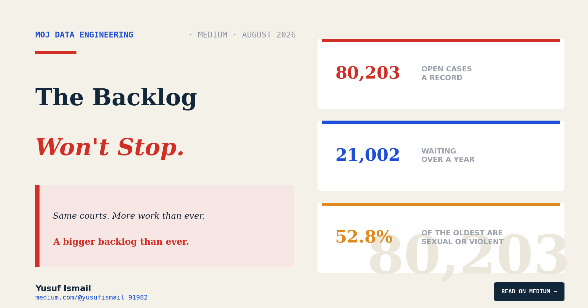
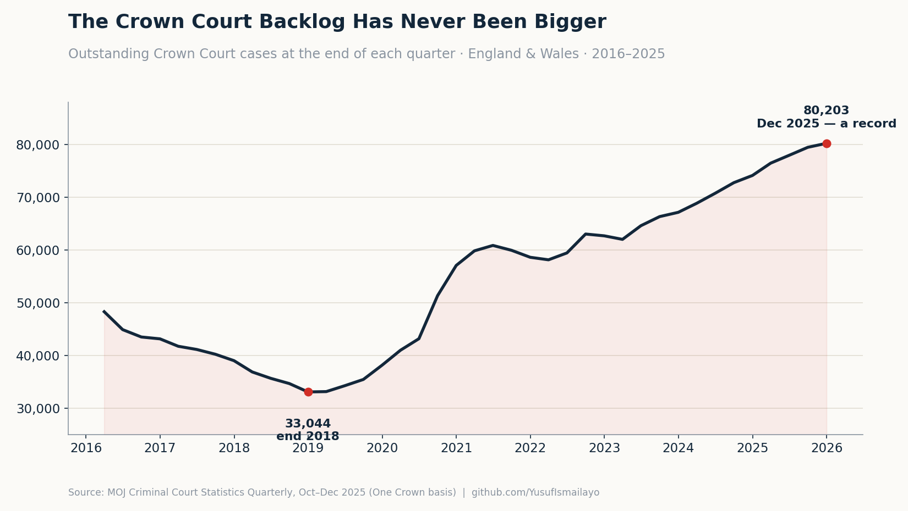
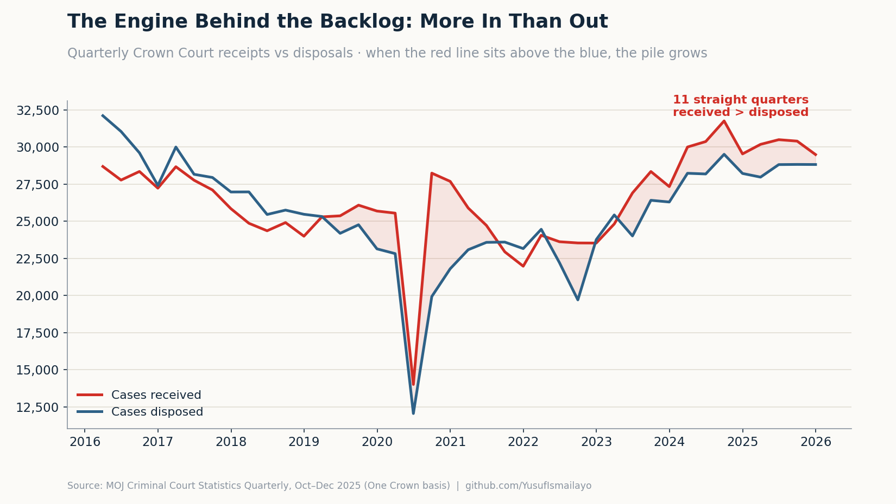
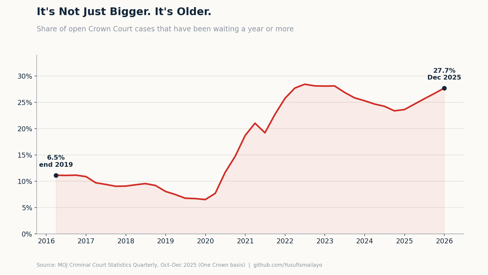
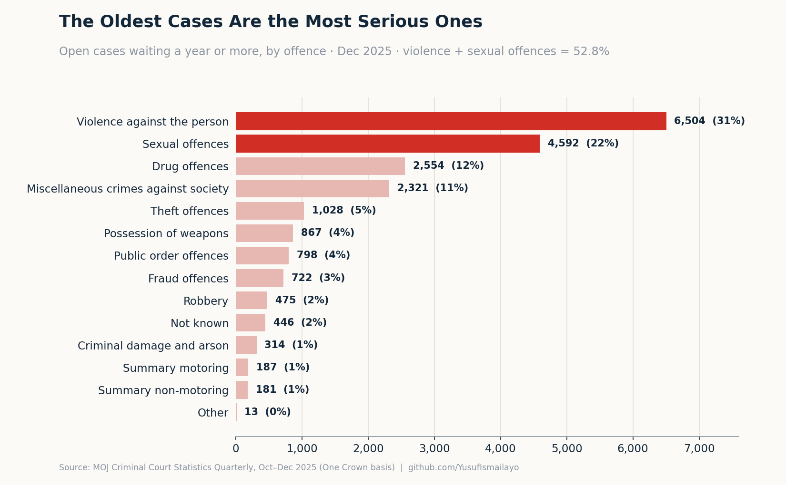

# The Crown Court Is Working Harder Than Ever. The Backlog Still Hit a Record.

### I built a pipeline to measure it. 80,203 open cases — the most ever recorded. Eleven straight quarters where more came in than went out. And the people waiting longest are the victims of the most serious crimes.

*Yusuf Ismail · Data Engineer · [medium.com/@yusufismail_91982](https://medium.com/@yusufismail_91982)*

---

Somewhere in England right now, a woman is holding a piece of paper with a date on it.

It is her trial date. She reported a serious crime, the case was charged, and it was sent to the Crown Court. She has been told when she will finally sit in a courtroom and be asked to describe, out loud, the worst thing that happened to her.

The date is in 2027.

She has already waited. She will keep waiting. And while she does, the memory has to stay sharp enough to give evidence, because a case that fades is a case that collapses. The system is not asking her to move on. It is asking her to hold still, for years, until it is ready.

This is not a worst case. This is the middle of the pile.

I have been building data pipelines on public sector performance data for a while now — NHS outpatients, A&E, referral-to-treatment, cancer waits. This is my first project outside the NHS, and it is the Ministry of Justice: the Crown Court of England and Wales. The deeper I got into the numbers, the more I recognised the shape of them. It is the same shape as the NHS. A system that has quietly redefined a crisis as normal.

So I did what I always do. I built something to measure it properly.

## The number nobody wants to own

The Crown Court publishes a figure called the outstanding caseload. It is not receipts minus disposals. It is a straight headcount, taken on the last day of each quarter, of every case still open — every case where a defendant still has an offence without a final result.

At the end of December 2025, that number was **80,203**.

It is the highest figure the published records have ever shown. The Crown Court outstanding caseload has never, on record, been larger than it is right now.

To see how far that is from normal, you have to look back. At the end of 2018, the same number was **33,044**. At the end of 2019, before anyone had heard the word lockdown, it was **38,108**.

In six years, it has more than doubled.

*Outstanding Crown Court cases at the end of each quarter, 2016–2025.*

That is the headline. But the headline is the least interesting thing in this dataset. The real story is underneath it — in *why* the pile keeps growing, and in *who* is stuck at the bottom of it.

## The courts are working harder than ever. It isn't enough.

Here is the part I did not expect, and the part that undercuts the easy explanation.

The obvious story is that the courts have slowed down. That judges and staff are clearing fewer cases than they used to, and the backlog is the result. It is a tidy story. It is also wrong.

In the last quarter of 2019, the Crown Court disposed of 23,132 cases. In the last quarter of 2025, it disposed of **28,812** — nearly a quarter more. The court is not clearing fewer cases than before the pandemic. It is clearing more.

The problem is that even more are arriving.

I calculated the net flow for every quarter — cases received minus cases disposed. When that number is positive, the pile grows. And for the last **eleven quarters in a row**, stretching back nearly three years, it has been positive. Every single quarter, more cases have come in than the court could send out. Not once in almost three years has the Crown Court managed to end a quarter smaller than it started.

That is the engine. Demand has outrun a system that is already running faster than it ever has. You cannot dispose your way out of this by asking people to work harder, because they already are.

The courts cleared more cases than they have in years. The backlog still hit a record.

*Quarterly Crown Court receipts vs disposals — when the red line sits above the blue, the backlog grows.*

## Big is one problem. Old is a worse one.

A large backlog that moves quickly is a queue. A large backlog that *doesn't* move is something else. So I broke the open caseload down by age — how long each open case has been sitting there, unresolved.

At the end of 2019, 6.5% of open cases had been waiting a year or more. Roughly one in fifteen.

At the end of 2025, it was **27.7%**. More than one in four.

In raw numbers, that is **21,002 open cases** that have been live for over a year. Of those, **6,163** have been open for more than *two* years. (The Ministry of Justice quotes a slightly higher figure of over 22,000 for the year-plus group; I have used the more conservative count, and I explain the difference at the end. A smaller honest number beats a bigger shaky one.)

And there is a wave behind the wave. Another **17,893** cases are currently sitting in the six-months-to-a-year band. They have not crossed the one-year line yet. On current form, a large share of them will. The ageing is not finished. It is loading.

*Share of open Crown Court cases waiting a year or more, 2019–2025.*

## Same courts. Same country. And the oldest cases are the most serious ones.

This is the finding I keep coming back to.

You might assume the cases that get stuck are the small, fiddly, low-priority ones — that the serious cases get pushed to the front. I assumed something like that too. The data says the opposite.

I took the cases that have been open a year or more and broke them down by offence. Here is what sits at the bottom of the pile:

**Violence against the person** — 6,504 cases. **Sexual offences** — 4,592 cases.

Together, those two categories make up **52.8%** of every case that has been waiting over a year. More than half of the oldest cases in the Crown Court are the most serious and most traumatic ones there are. Rape. Serious assault. The cases where a victim has to give evidence, and where the wait is not an administrative inconvenience but a second injury.

The system is not failing at the edges. It is slowest exactly where the stakes are highest.

*Open cases waiting a year or more, by offence, December 2025.*

## What the data cannot tell you

I want to be careful here, because this dataset comes with a history that matters.

In 2024, the Ministry of Justice **paused** this publication. They had found that historical Crown Court figures were wrong, and they went back, rebuilt the methodology under a project called "One Crown," and re-issued revised numbers from December 2024 onward. That means the long back-series I am quoting has been restated on a single consistent basis — which is exactly why I can compare 2019 to 2025 at all — but it also means these numbers have moved before, and the Ministry has been explicit that some may move again. I built the pipeline to re-ingest the whole series from each new release for precisely this reason. The data quality history is not a footnote to this story. It is part of it.

Two more honest limits. The outstanding caseload is a snapshot, not a running total, so you cannot rebuild it by adding up flows — I take it as the count the court records on the day. And the "over a year" figure depends on whether you count every open case or only those whose exact age is recorded; the gap between the two is where the 21,000 and the 22,000 come from. I have shown my working for both.

And the thing no dataset can tell you: *why*. The numbers show that the pile is growing, that it is ageing, and that the oldest cases are the most serious. They do not show you the courtroom that sat empty for lack of a judge, the trial pulled at the last minute, the barrister who wasn't available, the case adjourned for the fourth time. The data shows the outcome. It does not show the cause.

What it does do — clearly, reproducibly, at scale — is make the outcome impossible to look away from.

## The pipeline, for those who want it

The Crown Court publishes this data every quarter, and almost nobody opens it, because it does not arrive as data. It arrives as a set of interactive Excel "tools" — and the real figures are not on the sheets you can see. They are buried inside each file's pivot cache, a hidden store holding, across the four files I needed, just under **nine million raw rows**.

I built a Bronze → Silver → Gold medallion pipeline in Python and Parquet to pull those rows out and make them answerable. Bronze copies every raw row out of the hidden cache and changes nothing. Silver cleans it — friendly names, an ordered set of age bands, geography levels tagged so national and regional figures can never be accidentally summed together. Gold produces the small, purpose-built tables behind every chart in this article.

Then I checked it the only way that counts: I rebuilt the Ministry's own headline figure — 80,203 — from my own tables. It matched to the case. If my pipeline had drifted by a single record, that number would have been wrong.

Every figure in this article was computed by that pipeline from the Ministry of Justice's published data. The code is on GitHub, and anyone can clone it and get the same numbers.

## Back to the date on the paper

The woman waiting for 2027 is not a statistic to the system. She is a case number in an outstanding caseload of 80,203, in the year-plus band that now holds more than 21,000 people, in the sexual-offences category that makes up a fifth of the oldest cases in the country.

She is, in other words, exactly where the data says she would be.

The Crown Court is working harder than it has in years. It is still losing ground, every quarter, for nearly three years straight. And the people it keeps waiting longest are the ones who reported the most serious crimes and were promised their day in court.

They will get it. Eventually.

I built a pipeline to measure the wait. I am not sure that changes anything. But somebody should be counting.

---

*This analysis covers the Ministry of Justice's Criminal Court Statistics Quarterly, the October–December 2025 release, published March 2026, covering the Crown Court of England and Wales. Figures are drawn from the outstanding-caseload and open-case-age tools and processed through a Bronze → Silver → Gold pipeline built in Python and Parquet. The Crown Court series was revised under the Ministry's "One Crown" project in 2024–25 and is quoted here on that restated basis. Full code and data dictionary on GitHub.*

*GitHub: github.com/YusufIsmailayo/moj-crown-court-statistics-pipeline · Medium: [@yusufismail_91982](https://medium.com/@yusufismail_91982)*

*This is the first piece in a series on the Crown Court backlog. The next asks a simpler question: of the people waiting, who is on bail — and who is in a prison cell, still legally innocent, waiting for a trial that hasn't come?*

---

*The Crown Court backlog — a four-part series:* **1. Working Harder Than Ever** · [2. The People in a Cell](https://medium.com/@yusufismail_91982/the-people-in-a-cell-arent-waiting-the-longest-afa14a44e5f1) · [3. Justice Has a Postcode Too](https://medium.com/@yusufismail_91982/justice-has-a-postcode-too-eb4d1866d07d) · [4. The Number That Vanished](https://medium.com/@yusufismail_91982/the-number-that-vanished-3fcd507f49ba)
