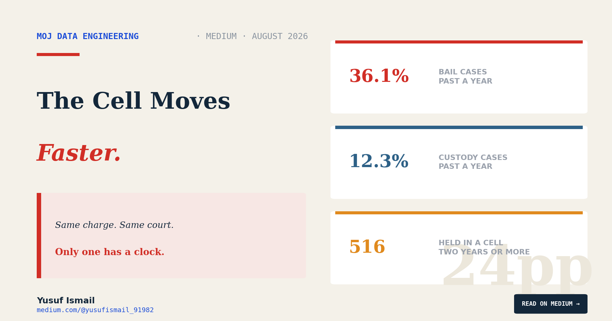
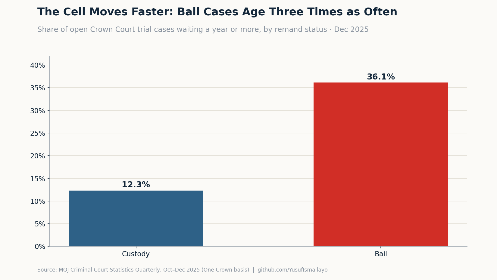
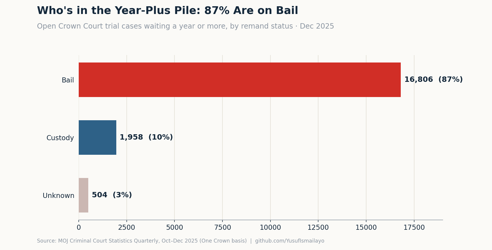
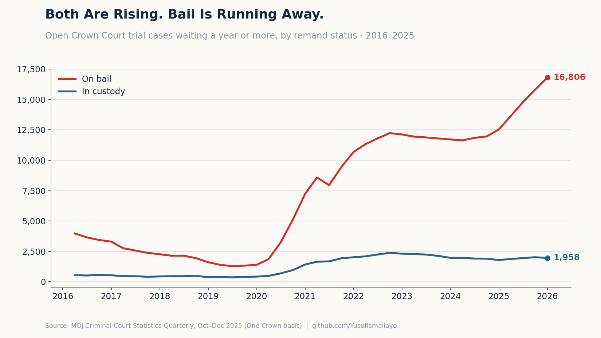

# The People in a Cell Aren't Waiting the Longest

### On remand for a Crown Court trial, custody cases age *less* than bail cases — 12% vs 36% past a year. But 516 people have now been held in a cell, still legally innocent, for over two years.

*Yusuf Ismail · Data Engineer · [medium.com/@yusufismail_91982](https://medium.com/@yusufismail_91982)*

---

Two people are waiting for the same thing tonight.

The first is in a prison cell. He was charged with a serious offence, refused bail, and remanded into custody to wait for his Crown Court trial. He has not been convicted of anything. Under the law, he is innocent. He is also locked up.

The second is at home. Same kind of charge, same court, but she was released on bail. There are conditions — a curfew, an address she can't leave, people she can't contact. The case sits over her life like weather. She has not been convicted of anything either.

Both are waiting for a trial. If I asked you which one has been waiting *longer*, you would probably say the man in the cell. It feels obvious. Surely the system hurries when it has someone locked up.

It doesn't. It's the other way round, and it isn't close.

In [my last piece](https://medium.com/@yusufismail_91982) I found the Crown Court backlog had hit a record 80,203 open cases, and that more than a quarter of them had been waiting over a year. This is the question that came next: of the people waiting for a *trial*, who is on bail, and who is in a cell — and which of them waits longer?

## The number that should surprise you

At the end of December 2025, there were 63,149 open trial cases in the Crown Court. About one in four of them — 15,878 — involved a defendant remanded in custody. The rest were on bail.

Now split each group by how long it has been waiting.

Of the custody cases, **12.3%** had been open for a year or more. Of the bail cases, **36.1%** had. A defendant on bail is roughly three times as likely to be stuck in the year-plus pile as a defendant in a cell.

*Share of open Crown Court trial cases waiting a year or more, by remand status, December 2025.*

Put it in people. Of every trial case that has been waiting over a year, **87% are bail cases.** Only about one in ten involves someone held in custody.

*Open trial cases waiting a year or more, split by remand status, December 2025.*

The man in the cell is not at the front of the queue because the system cares more about him. He is at the front because the law forces it to.

## Why the cell moves faster

Here is the mechanism, and it deserves to be stated fairly, because it is doing exactly what it was designed to do.

When someone is held in custody before trial, a clock called the **custody time limit** starts. In broad terms, the law sets a maximum period a defendant can be detained while waiting — and if the trial can't happen in time, the court must either extend that limit or release them. That legal pressure pushes custody cases up the list. They get heard first, not because they are the most serious or the oldest, but because a defendant is sitting in a prison cell and the clock is running.

So the Crown Court *does* triage. It just triages by who is locked up — not by who has waited longest, and not, as I found last time, by how serious the offence is.

That is a defensible thing to prioritise. Detaining an unconvicted person is the most serious thing the pre-trial system can do, and it is right that it carries the tightest clock. I'm not arguing the triage is wrong.

I'm arguing about what it leaves behind.

## Custody moving faster is not the same as custody being fine

Before I turn to the people on bail, the custody number deserves a second look, because "ages less" is not "acceptable."

Right now, **1,958 people are held in custody in cases that have been open for a year or more.** Of those, **516 have been in a cell for two years or more** — unconvicted, presumed innocent, held for the length of a full degree while they wait for a jury to be sworn. Custody time limits are meant to prevent exactly this, and they can be, and routinely are, extended by the court.

And this is not the old normal. At the end of 2019, 423 custody cases had been open a year or more. It is now 1,958 — more than four times as many. The clock still runs. It is just running slower than it used to.

## The people the clock forgets

Now the majority. The people on bail.

**16,806 defendants on bail have been waiting over a year** for their Crown Court trial. **4,798 of them have been waiting more than two years.** These are the cases with no custody clock ticking behind them — so when the court is deciding what to list next, they are the ones that can safely slip.

Bail is not freedom. It is life on pause, sometimes for years: a curfew every night, an exclusion zone, a job you keep having to explain, a holiday booked around a court date that then moves, a phone you answer wondering if this is the call. And it is not only the defendant who waits. When the accused is on bail, the person who reported the crime is often waiting in the same town, for years, for the trial that will finally decide it.

The bail figure has not crept up. It has detonated. At the end of 2019, 1,392 bail cases had been open a year or more. It is now 16,806 — twelve times higher.

*Open trial cases waiting a year or more, by remand status, 2016–2025.*

Same court. Same charge. Same year-long wait. The only difference is whether there is a clock forcing the system to notice you.

## What the data cannot tell you

Three honest limits, because this one matters.

The remand status here is the *latest* recorded status for each open case, not its whole history. A defendant can be remanded into custody, then released on bail, or the reverse, as a case drags on. So these are snapshots of where people stand now, not a full account of everyone who has spent time in a cell.

There is also an **Unknown** group I have kept out of the headline: 760 open trial cases where the remand status isn't cleanly recorded, and two-thirds of them have been open over a year. That is a small number against 63,000, but the fact that the oldest cases are the ones most likely to have a missing status is itself a quiet signal — the longer a case runs, the messier its record gets. I've flagged it rather than buried it.

And the deepest limit is the same as last time: the data shows *who* waits and *how long*, but never *why* any individual case stalled. It cannot tell you which bail case sat because a courtroom had no judge, and which sat because it genuinely needed the time.

## The pipeline

As in the first piece, every figure here is computed from the Ministry of Justice's published Crown Court data through the same Bronze → Silver → Gold pipeline — the raw pivot-cache rows pulled out, cleaned, and cut down to one small table of open cases by remand status and age. The remand split is a Silver-layer step: the raw files bury it inside labels like `04. Indictable only trials: remanded in custody`, which the pipeline separates into a clean case type and a clean remand status so it can be counted at all. Code and data dictionary are on GitHub; anyone can clone it and get these same numbers.

## Two people, one clock

Go back to the two people waiting tonight.

The man in the cell will, in all likelihood, be tried sooner — not because his case matters more, but because the law will not let the court forget he is there. The woman on bail, and the person who reported the crime against her, will very probably wait longer, because nothing is forcing the system to count their time.

That is the uncomfortable shape of it. The Crown Court has one lever it cannot ignore — a defendant in a cell — and it pulls that lever well. Everyone standing outside its reach is waiting on a queue that has grown twelvefold in six years and has no clock of its own.

The backlog decides who waits. A prison cell decides who gets noticed. And most of the people in the year-long pile are noticed by neither.

---

*This analysis covers the Ministry of Justice's Criminal Court Statistics Quarterly, the October–December 2025 release, covering open trial cases at the Crown Court of England and Wales by remand status. Figures are on the revised "One Crown" basis and were computed through a Bronze → Silver → Gold pipeline built in Python and Parquet. Remand status reflects the latest recorded status for each open case. Full code and data dictionary on GitHub.*

*GitHub: github.com/YusufIsmailayo/moj-crown-court-statistics-pipeline · Medium: [@yusufismail_91982](https://medium.com/@yusufismail_91982)*

*This is the second piece in a series on the Crown Court backlog. The first looked at the size and age of the caseload. The next asks where: whether the wait you get depends on which court your case happens to land in.*

---

*The Crown Court backlog — a four-part series:* [1. Working Harder Than Ever](https://medium.com/@yusufismail_91982/the-crown-court-is-working-harder-than-ever-the-backlog-still-hit-a-record-5a4c276ef9a1) · **2. The People in a Cell** · [3. Justice Has a Postcode Too](https://medium.com/@yusufismail_91982/justice-has-a-postcode-too-eb4d1866d07d) · [4. The Number That Vanished](https://medium.com/@yusufismail_91982/the-number-that-vanished-3fcd507f49ba)
