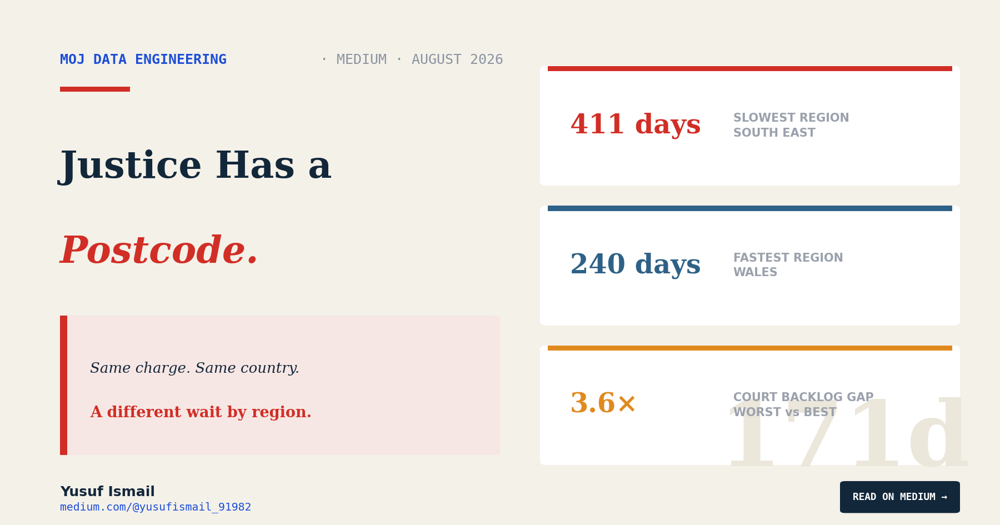
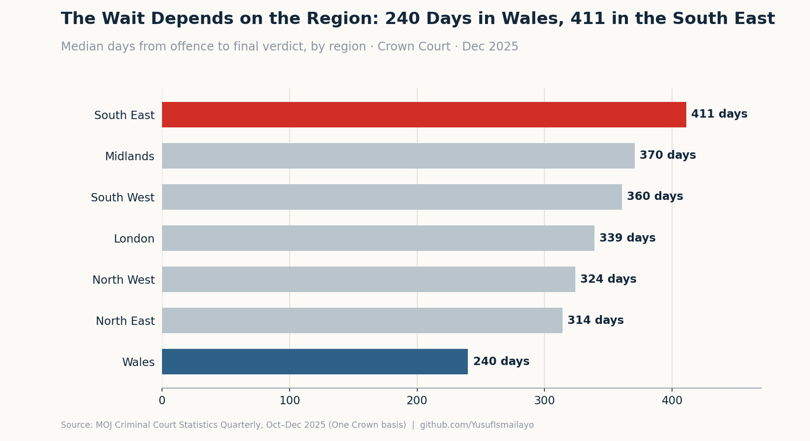
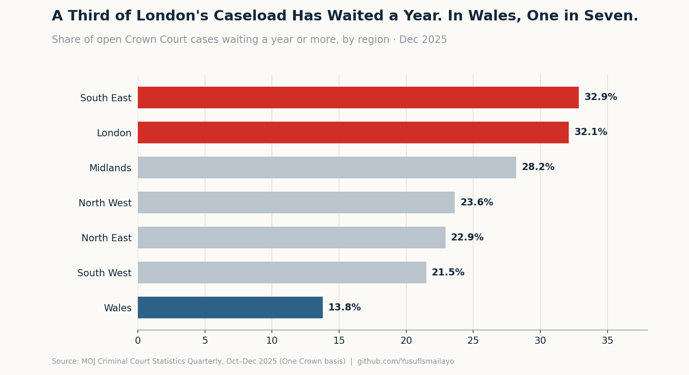
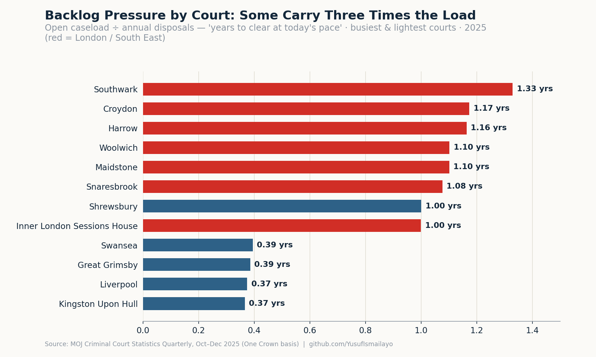

# Justice Has a Postcode Too

### The typical case reaches a verdict in 240 days in Wales and 411 in the South East. A third of London's open cases have waited over a year — in Wales, one in seven. Where your case lands decides how long you wait.

*Yusuf Ismail · Data Engineer · [medium.com/@yusufismail_91982](https://medium.com/@yusufismail_91982)*

---

A case does not choose its court.

When a criminal case is serious enough to leave the magistrates' court, it is sent up to the Crown Court — and "the Crown Court" is not one building. It is around seventy of them, scattered across England and Wales, from Snaresbrook in east London to Truro in Cornwall. Which one your case lands in is not a decision anyone makes on the merits. It is geography: where the offence happened, which court covers that patch of the map. A clerical fact, settled before a word of evidence is heard.

[The first piece](https://medium.com/@yusufismail_91982/the-crown-court-is-working-harder-than-ever-the-backlog-still-hit-a-record-5a4c276ef9a1?sharedUserId=yusufismail_91982) in this series looked at *how big* the Crown Court backlog is; [the second](https://medium.com/@yusufismail_91982/the-people-in-a-cell-arent-waiting-the-longest-afa14a44e5f1?sharedUserId=yusufismail_91982), at *who* is stuck in it. This piece is about a quieter question, and in some ways a more uncomfortable one. Take the same charge, the same kind of defendant, the same kind of victim — and send one case to a court in the South East and the other to a court in Wales. On paper, identical. Does the wait come out the same?

It does not. And the gap is measured in months.

## The same case, half a year apart

The cleanest way to measure a wait is end to end: from the date an offence is alleged to have happened to the date a court reaches its final decision. The Ministry of Justice publishes it, and I broke it down by region.

For the typical case — the median — the journey from offence to verdict took **240 days in Wales**. In the **South East, it took 411**. That is a gap of 171 days, close to six months, between the middle case in the fastest region and the middle case in the slowest. Across England and Wales the median sat at 346 days.

*Median days from offence to final verdict, by region, December 2025.*

Those are the *typical* cases. The averages are far higher — dragged up by a long tail of very old cases, the ones I wrote about last time — but the median is the honest number for "what most people experience," and even the median splits the country almost in half.

Now look at the backlog itself, region by region: the share of open cases that have already been waiting a year or more.

In the **South East, it is 32.9%. In London, 32.1%.** Roughly a third of all open cases in those regions have been live for over a year. In **Wales, it is 13.8%** — fewer than half the rate. The national figure, 27.7%, hides a country pulling apart at both ends.

*Share of open Crown Court cases waiting a year or more, by region, December 2025.*

Two different measures — how long completed cases took, and how old the open ones are — and they agree. The South East and London are the slowest and the most backed up. Wales and the North West clear cases fastest and carry the youngest piles.

## Going finer: the court on your doorstep

Region is as far as the *timeliness* data goes — I'll come back to why. But for the backlog itself, the Ministry publishes figures right down to the individual court, and that lets me get specific.

I built a simple ratio for each court: its open caseload divided by the number of cases it clears in a year. Read it as "how long the current pile would take to clear at today's pace." It is a proxy, not a promise about any one case — but it strips out the fact that big courts naturally have big caseloads, and shows you where the *pressure* really sits.

The median court sits at about 0.68 — roughly eight months of work queued. At the top:

- **Southwark** — 1.33 years of backlog
- **Croydon** — 1.17
- **Harrow** — 1.16
- **Woolwich** and **Maidstone** — 1.10
- **Snaresbrook**, the single busiest Crown Court in the country — 1.08

At the other end sit courts like **Liverpool** and **Kingston upon Hull**, both around 0.37, and **Swansea** at 0.39.

So a case sent to Southwark lands behind more than three times as much backlog, relative to how fast that court works, as an identical case sent to Liverpool. Same charge. Same country. Same courts. A different queue entirely — and the top of that list is almost entirely London and the South East, exactly where the region numbers already pointed.

*Open caseload divided by annual disposals — the busiest and lightest courts, 2025.*

## The obvious objection, and what it leaves standing

There is a fair challenge to all of this, and I want to make it myself.

London and the South East are not just slow — they are *busy*, and they handle a heavier share of the most serious, most complex cases: the long contested trials that genuinely take more time, more court days, more of everything. Some of the regional gap is not "London is worse at justice." It is "London is doing harder work." A case-mix difference can masquerade as a geography difference, and I can't fully separate the two from this data.

So I'll be careful about the claim. I am not saying the courts in the South East are failing where Wales is succeeding. I am saying something narrower and, I think, harder to argue with: the wait a person actually experiences — victim or defendant — depends heavily on which region, and which building, their case happened to be sent to. Three independent measures agree on the direction, and the gaps are large. Whatever the mix of causes, the person waiting still waits.

## What the data cannot tell you

This piece has a specific limit worth stating plainly, because it shaped what I could and couldn't show.

**Court-level wait *times* are not published — only volumes are.** The Ministry gives court-by-court figures for how many cases are received, disposed and open, but the end-to-end timeliness — the actual offence-to-verdict clock — only goes down to region. That is why the backlog ratio above is a court-level *pressure* measure, while the 240-vs-411-days figure is regional. I have kept the two separate throughout rather than implying I can time a case to the individual courthouse. I can't, and neither can anyone working from this data.

The usual limits hold too. Timeliness is measured only on *completed* cases, looking back — so it can't see the cases still stuck. The median is the typical wait, but the mean tail is far longer. And the data shows the gap without ever explaining it: it cannot tell you how much is complexity, how much is court capacity, how much is judges or barristers or buildings.

## The pipeline

As before, every figure here is computed from the Ministry of Justice's published data through the same Bronze → Silver → Gold pipeline. Two Gold cuts sit behind this piece: one that reads end-to-end timeliness by region, and one that computes each court's open-caseload-to-disposals ratio from the court-level tables. The geography itself needed care in the Silver layer — the raw files stack national, regional and court rows in a single column, so the pipeline tags each with its level, which is the only thing stopping a national total being accidentally added on top of the regions beneath it. Code and data dictionary are on GitHub; anyone can clone it and get the same numbers.

## The case that didn't choose

Go back to the two cases sent up in the same week — one to the South East, one to Wales.

Neither defendant chose their court. Neither victim did. The building was decided by where the alleged offence happened, and nobody involved treated that as a decision about time. But it was one. On the numbers, the case in the South East will most likely take months longer to reach a verdict than the one in Wales — not because it is more serious, or more contested, or more anything a court is supposed to weigh, but because of which dot on the map it was sent to.

We already knew justice was slow. This is the part that should sit less easily: it is slow by a different amount depending on where you are — and where you are was never yours to choose.

---

*This analysis covers the Ministry of Justice's Criminal Court Statistics Quarterly, the October–December 2025 release, for the Crown Court of England and Wales. Regional timeliness is the median number of days from offence to completion (all closed cases, all offences); the court backlog ratio is each court's open caseload divided by its annual disposals. Figures are on the revised "One Crown" basis and were computed through a Bronze → Silver → Gold pipeline in Python and Parquet. Court-level timeliness is not published; timeliness figures are regional. Full code and data dictionary on GitHub.*

*GitHub: github.com/YusufIsmailayo/moj-crown-court-statistics-pipeline · Medium: [@yusufismail_91982](https://medium.com/@yusufismail_91982)*

*This is the third piece in a series on the Crown Court backlog. The next and final one steps back from the numbers to the numbers themselves: how the Ministry got its Crown Court figures wrong, paused, and rebuilt them — and what it takes to trust a statistic at all.*

---

*The Crown Court backlog — a four-part series:* [1. Working Harder Than Ever](https://medium.com/@yusufismail_91982/the-crown-court-is-working-harder-than-ever-the-backlog-still-hit-a-record-5a4c276ef9a1) · [2. The People in a Cell](https://medium.com/@yusufismail_91982/the-people-in-a-cell-arent-waiting-the-longest-afa14a44e5f1) · **3. Justice Has a Postcode Too** · [4. The Number That Vanished](https://medium.com/@yusufismail_91982/the-number-that-vanished-3fcd507f49ba)
