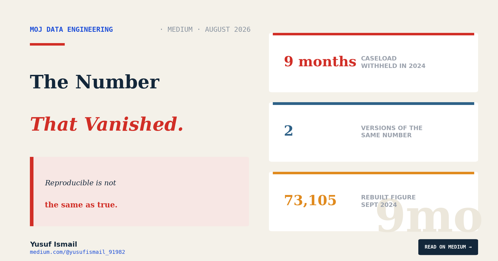
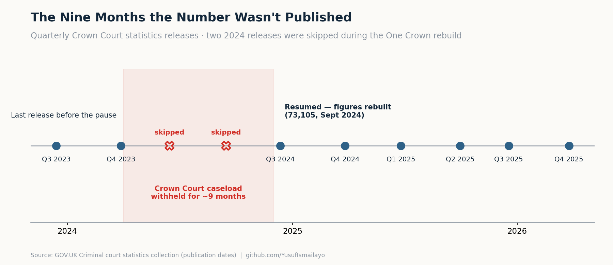

# The Number That Vanished

### For most of 2024, the Ministry of Justice stopped publishing the Crown Court caseload — because two arms of the same government had been quietly producing different numbers. This is what it took to trust it again, and why I built my pipeline to survive the next revision.

*Yusuf Ismail · Data Engineer · [medium.com/@yusufismail_91982](https://medium.com/@yusufismail_91982)*

---

For most of 2024, one of the most important numbers in the justice system did not exist.

Not "was high." Not "was bad." Did not get published at all. Between the release in March 2024 and the next one in December, the Ministry of Justice simply stopped telling anyone how many cases were sitting open in the Crown Court. Two quarterly updates that should have come — summer, autumn — never did. For nine months, the single figure that every headline about court delays depends on was a blank.

I've spent three pieces in this series treating the Crown Court caseload as solid ground: 80,203 open cases, 21,000 waiting over a year, a wait that changes by region. This final piece is about the ground itself. Because the number I built all of that on was, less than two years ago, wrong enough that the government pulled it.

*Quarterly Crown Court statistics releases. Two 2024 releases were skipped during the One Crown rebuild.*

## Why a statistic disappears

Numbers don't usually vanish because they're embarrassing. They vanish because someone loses confidence that they're true.

That is what happened here, and the cause is worth sitting with. For years, two parts of the same system — the Ministry of Justice, which publishes the statistics, and HMCTS, which runs the courts — had each been maintaining their *own* version of the caseload data. Same question, two answers, drifting apart. On top of that, records in Common Platform, the newer case-management system the courts had been moving onto, had been knocked out of shape by a mix of human error, technical faults, and data-coding problems.

So the headline caseload wasn't one number with a small error bar. It was a number that different parts of government computed differently, built on records that nobody could fully vouch for. When that became clear, the honest move was not to publish a figure with a footnote. It was to stop publishing until it could be fixed.

I want to be fair about this, because it would be easy to read it as a scandal. It isn't, quite. Pulling a national statistic is a costly, visible thing to do — it invites exactly the kind of article I'm writing now. That the Ministry did it anyway is, in its way, the system working: choosing "we don't know" over "here's a number we can't stand behind." The failure was letting two versions of the truth exist for years. The response to it was, I think, the right one.

## Rebuilding a number from scratch

What came next is the part that matters for anyone who uses official data.

The fix was a project called **One Crown**. In plain terms, it did the thing that should have been true all along: it made MoJ and HMCTS agree on a single definition of the caseload and compute it from a single, shared pipeline, so there could only ever be one number. Not two arms of government reconciling after the fact — one source of truth by design.

They didn't just re-issue the figure and hope. An external team was brought in to audit the rebuilt statistics, and its conclusion was deliberately measured: that the Ministry "could have significant confidence" in the Crown Court caseload figures. There were two public consultations, in December 2024 and March 2025, on the definitional changes. And the whole back-series was restated on the new basis, so the history lined up with the present. The independent statistics regulator has since reviewed the quality of the figures too.

When the number came back, in December 2024, it read **73,105** — the restated open caseload as of September 2024. That is the figure that, one year later, had climbed to the 80,203 I opened this series with. The line I've been drawing across every chart begins, quietly, at a number that had to be rebuilt before it could be drawn at all.

It's worth being clear about what *didn't* pause during those nine months. The backlog didn't. Cases kept arriving. People kept sitting in cells waiting for trials. Victims kept waiting for a date. The number stopped; the thing it measured did not. For the better part of a year, the system carried on getting worse in a way nobody was officially counting — which is its own small argument for why counting, done honestly, matters.

## What this means for every figure I've published

Here is the uncomfortable implication, stated plainly.

Every number in the first three pieces of this series — the record backlog, the ageing caseload, the custody-versus-bail split, the regional gaps — sits on top of a data series that was withdrawn and rebuilt less than two years ago. And the Ministry has been explicit that it isn't finished: it expects some series to keep moving, with "an increased likelihood of revisions" as the new systems settle.

That is not a reason to distrust the numbers. It is a reason to hold them correctly. These are, on the regulator's and the external reviewer's assessment, the best figures the system has ever produced for this question — precisely *because* they were forced through this reckoning. But "best we've had" and "final" are different claims, and honest use of the data means keeping the difference in view.

## Building for a number that gets rewritten

This is where the engineering stops being plumbing and becomes the point.

When I built the pipeline behind this series, I made one decision early that everything else hangs on: **it does not append.**

Most reporting pipelines work by accumulation. Each quarter you take the new release and add the latest row to the bottom of the table you already have. It's efficient, and for a dataset whose past never changes, it's exactly right.

The Crown Court's past changes. So picture what append-only does here. In March, the release says 2019 ended with a certain number of open cases, and you store it. In December, the Ministry quietly restates the history, and that same 2019 now ends on a different number. An append-only table is holding both at once: the old history up top, the newest quarter computed on the new basis at the bottom. The chart still draws a clean line — but it is no longer *one* history. It is two, spliced at the join, and nobody looking at the line can see the seam. That splice is a miniature of the exact fault that broke the original: two versions of the same number, living in one table.

So mine does the wasteful-looking thing. It throws the whole table away and rebuilds the entire history from each new release, every time. It costs more, and it is the only honest option: when the past moves, the whole series moves with it, on a single basis — or it doesn't move at all.

Two other habits do the same job. Every row the pipeline lands carries its provenance — which file it came from, which release, and a fingerprint of that file — so any figure in any chart can be traced back to the exact publication it came from. And nothing is trusted until it's checked: at the end of the run, the pipeline rebuilds the Ministry's own headline number from my own tables and refuses to continue unless it matches to the case.

None of that makes my numbers *true*. It makes them *reproducible* — and it makes them *revisable*. When the next release moves the past again, I don't patch it. I re-run it, and the history moves with it, honestly.

## What the data cannot tell you

The limit here is the deepest one in the whole series, so I'll say it straight: I cannot tell you these numbers are correct. I can tell you they are the official figures, that they were rebuilt under external scrutiny, and that my pipeline reproduces them exactly from source. That is reproducibility, not proof. A number can be computed perfectly and still rest on records that were entered wrong in a courtroom two years ago.

That gap — between "I can reproduce it" and "it is true" — never fully closes with administrative data. The honest position isn't to pretend it does. It's to be loud about which one you're standing on. I'm standing on reproducibility, with the source named, the code open, and the revisions expected.

## Holding a number with both hands

Go back to the nine-month blank.

The figure that vanished for nine months is now quoted every week, in every headline about the state of the courts, as though it had always existed in its current form — solid, settled, unremarkable. It hadn't, and it isn't — not in the way "solid" usually implies. It is a made thing, with a supply chain and a history, produced by two systems that had to be forced to agree, and it can be made again.

That is not a weakness peculiar to the Crown Court. It is true of almost every official number you will read this year — the ones about hospitals, prices, migration, crime. Behind each is a pipeline, a set of definitions, some people, and a history of the times it was wrong. Trusting a statistic well doesn't mean believing it is exactly right. It means being able to see how it was made, and holding it accordingly: firmly enough to act on, loosely enough to let go when the next release moves it.

I built a pipeline to measure a backlog. What it actually taught me was how to hold a number — with both hands, and no illusions.

---

*This is the final piece in a four-part series on the Crown Court backlog. This analysis covers the Ministry of Justice's Criminal Court Statistics Quarterly and the surrounding One Crown data-assurance work of 2024–25. The Crown Court caseload series was paused during 2024, rebuilt under the One Crown project, externally assured, and restated; figures are quoted on that restated basis and were processed through a Bronze → Silver → Gold pipeline built in Python and Parquet. Full code and data dictionary on GitHub.*

*GitHub: github.com/YusufIsmailayo/moj-crown-court-statistics-pipeline · Medium: [@yusufismail_91982](https://medium.com/@yusufismail_91982)*

*The three earlier pieces looked at the size and age of the backlog, who is waiting on remand, and how the wait changes by region. This one looked at the number underneath all of them.*

---

*The Crown Court backlog — a four-part series:* [1. Working Harder Than Ever](https://medium.com/@yusufismail_91982/the-crown-court-is-working-harder-than-ever-the-backlog-still-hit-a-record-5a4c276ef9a1) · [2. The People in a Cell](https://medium.com/@yusufismail_91982/the-people-in-a-cell-arent-waiting-the-longest-afa14a44e5f1) · [3. Justice Has a Postcode Too](https://medium.com/@yusufismail_91982/justice-has-a-postcode-too-eb4d1866d07d) · **4. The Number That Vanished**
